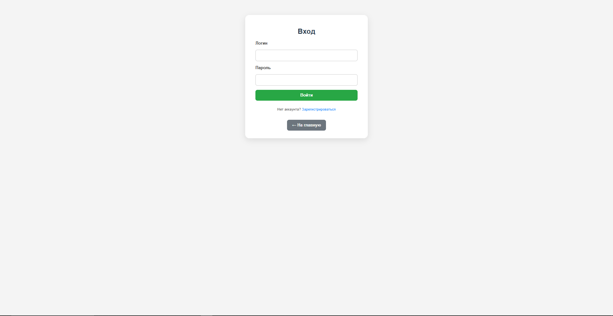
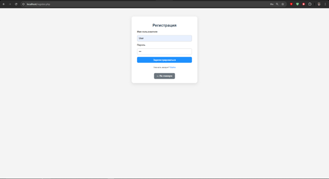
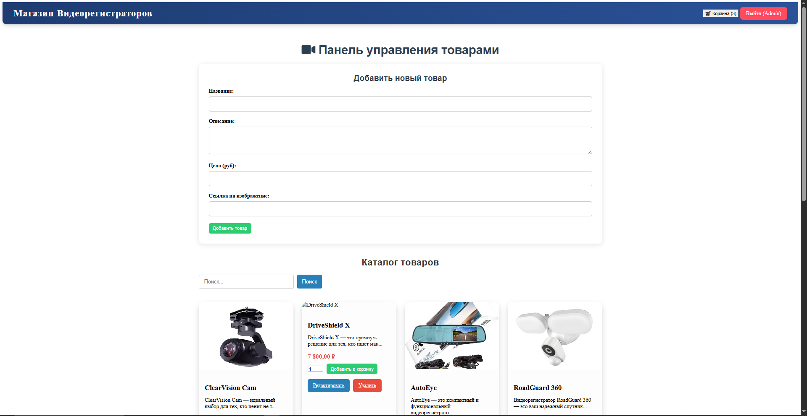
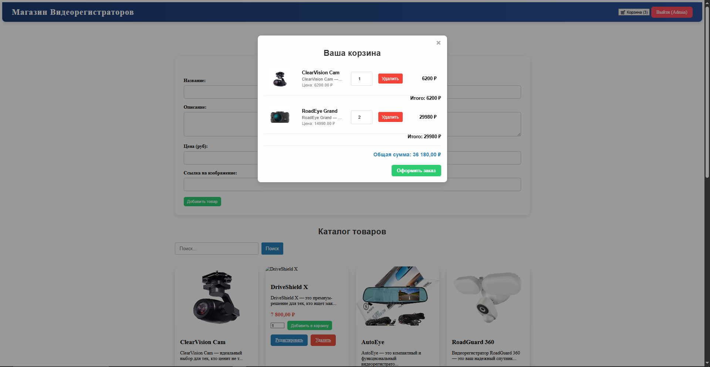

# Diploma Website Design

## Overview
Diploma project focused on designing a multi-page e-commerce website.
The goal was to create a clean and user-friendly interface with clear navigation
and consistent visual style across all pages.

## Design Focus
- Maintaining visual consistency across the website
- Creating a clear and user-friendly product card
- Designing smooth and intuitive navigation between pages
- Adapting design elements to fit the site’s needs

## Pages
- home
- product
- log in/sign in
- contacts
- about
- privacy policy

## Key Use Cases
- User registration and authentication
- Browsing and searching products
- Product details page
- Shopping cart interaction
- Admin product management interface

## Tools & Technologies
- UI design and layout
- HTML, CSS
- PHP, MySQL
- JavaScript

## What I Learned
- Designing multi-page interfaces
- Maintaining consistency across layouts
- Creating user-friendly navigation
- Working with real product structure

## Screenshots

### Authentication

### Home Page

### Product & Cart

### Static Pages

